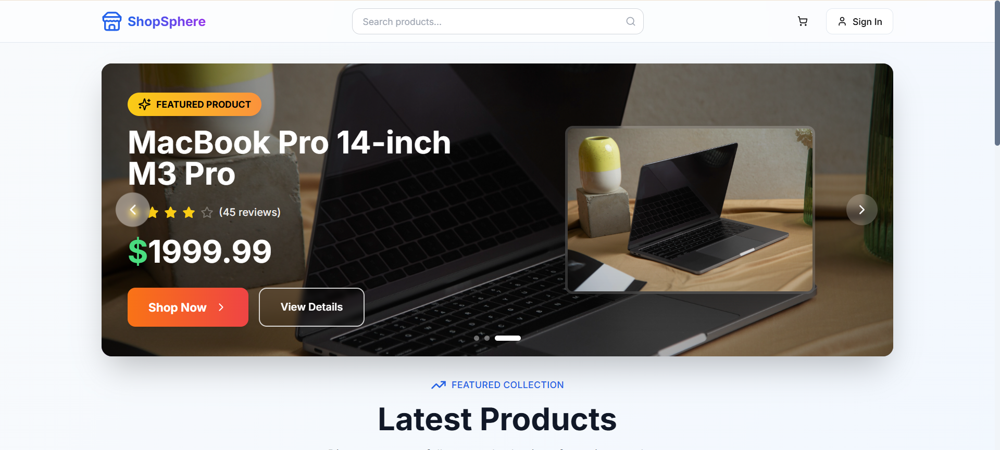
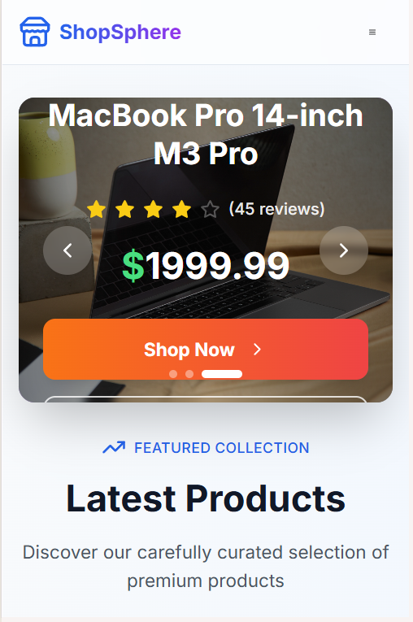
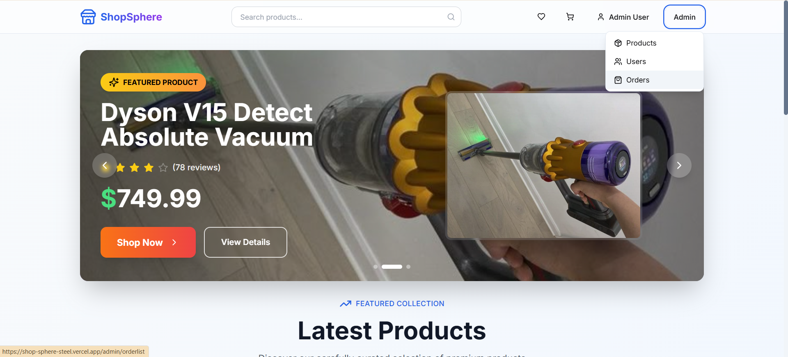

# 🛍️ ShopSphere - Modern E-Commerce Platform

<div align="center">


**A full-stack e-commerce application built with modern technologies and best practices**

[](https://shop-sphere-steel.vercel.app)
[](https://your-render-backend-url.com)
[](https://github.com/Durgesh-Vishwakarma/ShopSphere)


</div>

---

## � Live Deployment

### Production Environment
- **🎨 Frontend**: [Vercel](https://shop-sphere-steel.vercel.app) - Optimized React deployment with global CDN
- **⚡ Backend**: [Render](https://your-render-backend-url.com) - Auto-scaling Node.js hosting
- **📊 Database**: [MongoDB Atlas](https://cloud.mongodb.com) - Managed cloud database
- **🖼️ Images**: [Cloudinary](https://cloudinary.com) - Optimized image delivery

### Deployment Architecture
```
┌─────────────────┐    ┌─────────────────┐    ┌─────────────────┐
│     Vercel      │    │     Render      │    │  MongoDB Atlas  │
│   (Frontend)    │◄──►│   (Backend)     │◄──►│   (Database)    │
│                 │    │                 │    │                 │
│ • Global CDN    │    │ • Auto-scaling  │    │ • Managed DB    │
│ • Edge Caching  │    │ • Health Checks │    │ • Backups       │
│ • Preview URLs  │    │ • Zero Downtime │    │ • Monitoring    │
└─────────────────┘    └─────────────────┘    └─────────────────┘
```

---

## 🎯 Project Vision & Goals

ShopSphere is a modern, feature-rich e-commerce platform that demonstrates advanced full-stack development skills. Built with cutting-edge technologies and following industry best practices, this project showcases everything from responsive UI design to secure backend architecture.

### 🎯 Key Highlights

- **Modern Tech Stack**: React 18, Vite, Tailwind CSS, Node.js, Express, MongoDB
- **Advanced State Management**: Redux Toolkit with RTK Query for efficient data fetching
- **Responsive Design**: Mobile-first approach with Tailwind CSS and Framer Motion
- **Security First**: JWT authentication, rate limiting, data sanitization, and XSS protection
- **Performance Optimized**: Code splitting, lazy loading, image optimization, and caching
- **Production Ready**: Docker containerization, CI/CD pipelines, and comprehensive testing

---

## 🚀 Features

### 👥 User Experience
- **Authentication System**: JWT-based login/register with secure password handling
- **Shopping Cart**: Persistent cart with real-time updates and quantity management
- **Wishlist**: Save favorite products with user authentication
- **Order Management**: Complete order lifecycle from placement to tracking
- **User Profiles**: Account management with order history and preferences
- **Product Search**: Advanced search with filters and pagination
- **Reviews & Ratings**: Customer feedback system with star ratings

### 🛡️ Admin Dashboard
- **Product Management**: CRUD operations with image upload via Cloudinary
- **User Management**: Admin controls for user accounts and permissions
- **Order Processing**: Complete order management and status updates
- **Analytics Dashboard**: Sales metrics and performance insights
- **Inventory Tracking**: Real-time stock management

### 🎨 Modern UI/UX
- **Responsive Design**: Seamless experience across all devices
- **Dark/Light Themes**: Modern design system with consistent branding
- **Smooth Animations**: Framer Motion for enhanced user interactions
- **Accessible Components**: WCAG compliant with keyboard navigation
- **Loading States**: Skeleton screens and progressive loading
- **Error Boundaries**: Graceful error handling with user-friendly messages

---

## 🛠️ Technical Architecture

### Frontend Stack
```javascript
React 18.3.1          // Latest React with concurrent features
Vite 5.4.1            // Lightning-fast build tool
Tailwind CSS 3.4      // Utility-first CSS framework
Redux Toolkit         // Predictable state management
RTK Query            // Powerful data fetching and caching
React Router 6       // Client-side routing
Framer Motion        // Smooth animations and transitions
React Query          // Server state management
```

### Backend Stack
```javascript
Node.js              // JavaScript runtime
Express.js           // Web application framework
MongoDB Atlas        // Cloud database
Mongoose             // MongoDB object modeling
JWT                  // Secure authentication
Cloudinary           // Image storage and optimization
Winston              // Professional logging
```

### DevOps & Tools
```javascript
Docker              // Containerization
GitHub Actions      // CI/CD pipelines
ESLint & Prettier   // Code quality and formatting
Vitest              // Unit testing framework
Swagger             // API documentation
Helmet              // Security headers
```

---

## 📱 Screenshots

<div align="center">

### Desktop View


### Mobile Responsive


### Admin Dashboard


</div>

---

## 🏗️ Project Structure

```
ShopSphere/
├── 📁 backend/
│   ├── 📁 config/          # Database & external service configs
│   ├── 📁 controllers/     # Route controllers with business logic
│   ├── 📁 middleware/      # Authentication, error handling, security
│   ├── 📁 models/          # Mongoose schemas and models
│   ├── 📁 routes/          # Express route definitions
│   ├── 📁 utils/           # Helper functions and utilities
│   └── 📄 server.js        # Main server entry point
│
├── 📁 frontend/
│   ├── 📁 src/
│   │   ├── 📁 components/  # Reusable UI components
│   │   ├── 📁 screens/     # Page-level components
│   │   ├── 📁 slices/      # Redux slices and API endpoints
│   │   ├── 📁 hooks/       # Custom React hooks
│   │   ├── 📁 utils/       # Frontend utilities
│   │   └── 📁 assets/      # Static assets and styles
│   │
│   ├── 📁 public/          # Static files and images
│   └── 📄 vite.config.js   # Vite configuration
│
├── 📁 .github/workflows/   # CI/CD automation
├── 📄 docker-compose.yml   # Container orchestration
├── 📄 Dockerfile          # Container definition
└── 📄 package.json        # Project dependencies and scripts
```

---

## 🚀 Quick Start

### Prerequisites
- **Node.js** 18+ and npm
- **MongoDB** account (MongoDB Atlas recommended)
- **Cloudinary** account for image uploads

### 1. Clone Repository
```bash
git clone https://github.com/Durgesh-Vishwakarma/ShopSphere.git
cd ShopSphere
```

### 2. Environment Setup
Create `.env` file in root directory:
```env
MONGO_URI=your_mongodb_connection_string
JWT_SECRET=your_super_secret_jwt_key
CLOUDINARY_CLOUD_NAME=your_cloudinary_cloud_name
CLOUDINARY_API_KEY=your_cloudinary_api_key
CLOUDINARY_API_SECRET=your_cloudinary_api_secret
PORT=5000
NODE_ENV=development
PAGINATION_LIMIT=12
```

### 3. Install Dependencies
```bash
# Install backend dependencies
npm install

# Install frontend dependencies
cd frontend
npm install
cd ..
```

### 4. Seed Database
```bash
# Import sample data (users, products, orders)
npm run data:import
```

### 5. Run Application
```bash
# Run both frontend and backend concurrently
npm run dev

# Or run separately:
npm run server    # Backend on http://localhost:5000
npm run client    # Frontend on http://localhost:3000
```

---

## 🧪 Testing & Quality

### Running Tests
```bash
# Run all tests
npm test

# Run tests in watch mode
npm run test:watch

# Lint code
npm run lint

# Fix linting issues
npm run lint:fix
```

### Code Quality Tools
- **ESLint**: JavaScript/React code linting
- **Prettier**: Consistent code formatting
- **Vitest**: Fast unit testing framework
- **Lighthouse**: Performance and accessibility auditing

---

## 🔐 Security Features

- **JWT Authentication**: Secure token-based authentication
- **Password Hashing**: bcryptjs for secure password storage
- **Rate Limiting**: Prevent abuse with express-rate-limit
- **Data Sanitization**: MongoDB injection prevention
- **XSS Protection**: Cross-site scripting prevention
- **Security Headers**: Helmet.js for HTTP security headers
- **CORS Configuration**: Proper cross-origin resource sharing
- **Input Validation**: Server-side validation with express-validator

---

## 📊 Performance Optimizations

- **Code Splitting**: Dynamic imports for reduced bundle size
- **Image Optimization**: Cloudinary for automatic image optimization
- **Caching Strategy**: Redux persist and browser caching
- **Lazy Loading**: Components loaded on demand
- **Bundle Analysis**: Webpack bundle analyzer integration
- **Performance Monitoring**: Core Web Vitals tracking

---

## 🐳 Docker Support

### Build and Run with Docker
```bash
# Build and start containers
docker-compose up --build

# Run in background
docker-compose up -d

# Stop containers
docker-compose down
```

---

## 🚀 Deployment

### Frontend (Vercel)
```bash
# Build for production
cd frontend
npm run build

# Deploy to Vercel
vercel --prod
```

### Backend (Any Node.js hosting)
```bash
# Set environment variables on your hosting platform
# Deploy using your preferred method (Heroku, Railway, DigitalOcean, etc.)
```

---

## 📱 Demo Accounts

### Admin Account
- **Email**: `admin@email.com`
- **Password**: `password`
- **Access**: Full admin dashboard, product/user management

### Customer Accounts
- **Email**: `batman@email.com` | **Password**: `password`
- **Email**: `steve2@email.com` | **Password**: `steverogers`

---

## 🎨 Design System

### Color Palette
- **Primary**: Orange (#F97316) - Call-to-action elements
- **Secondary**: Blue (#3B82F6) - Links and highlights  
- **Success**: Green (#10B981) - Success states
- **Warning**: Yellow (#F59E0B) - Warnings
- **Error**: Red (#EF4444) - Error states
- **Neutral**: Gray shades - Text and backgrounds

### Typography
- **Headings**: Inter font family, bold weights
- **Body**: System fonts for optimal performance
- **Code**: Monospace fonts for technical content

---

## 🤝 Contributing

### Development Workflow
1. **Fork** the repository
2. **Create** a feature branch (`git checkout -b feature/amazing-feature`)
3. **Commit** changes (`git commit -m 'Add amazing feature'`)
4. **Push** to branch (`git push origin feature/amazing-feature`)
5. **Open** a Pull Request

### Code Standards
- Follow ESLint configuration
- Use Prettier for formatting
- Write descriptive commit messages
- Add tests for new features
- Update documentation as needed

---

## 📈 Roadmap

### Upcoming Features
- [ ] **Progressive Web App** (PWA) implementation
- [ ] **Payment Integration** (Stripe, PayPal)
- [ ] **Real-time Notifications** with WebSockets
- [ ] **Advanced Analytics** dashboard
- [ ] **Multi-language Support** (i18n)
- [ ] **Social Login** (Google, Facebook)
- [ ] **AI-Powered Recommendations**
- [ ] **Voice Search** integration

### Performance Improvements
- [ ] **Server-Side Rendering** (Next.js migration)
- [ ] **Edge Caching** implementation
- [ ] **Database Optimization** with indexing
- [ ] **CDN Integration** for static assets

---

## 📞 Contact & Support

<div align="center">

**Developer**: Durgesh Vishwakarma

[](https://your-portfolio.com)
[](https://linkedin.com/in/your-profile)
[](mailto:your-email@gmail.com)

</div>

---

## 📄 License

This project is licensed under the **MIT License** - see the [LICENSE](LICENSE) file for details.

---

## 🙏 Acknowledgments

- **React Team** for the amazing framework
- **MongoDB** for the flexible database solution
- **Vercel** for seamless deployment
- **Cloudinary** for image optimization
- **Open Source Community** for incredible tools and libraries

---

<div align="center">

**⭐ Star this repository if you found it helpful!**

*Built with ❤️ by Durgesh Vishwakarma*

</div>
